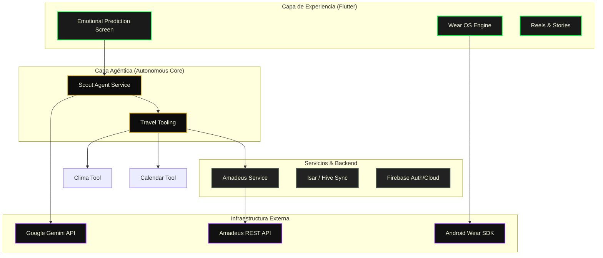

# 🏗️ ARQUITECTURA EVOLUTIVA - FeelTrip

Este documento detalla la evolución técnica de FeelTrip, desde su concepción como red social de viajes hasta su estado actual como un **Sistema de Agentes Autónomos** de vanguardia.

---

## 🚀 Hoja de Ruta del Proyecto (Phases)

| Fase | Nombre | Hito Técnico Principal | Estado |
|---|---|---|---|
| **Fase 1** | **Foundation** | Firebase Auth, CRUD de Diarios, UI Base (GetX). | Finalizada ✅ |
| **Fase 2** | **Social Layer** | Stories, Reels, Comments y Deep-links (share_plus). | Finalizada ✅ |
| **Fase 3** | **B2B & Analytics** | Dashboard de Agencias, KPIs de Retención, Telemetría. | Finalizada ✅ |
| **Fase 4** | **Offline & IoT** | Migración a **Riverpod**, Isar/Hive, Sincronización **Wear OS**. | Finalizada ✅ |
| **Fase 5** | **Agentic Era** | **AgentService**, Tool Calling (Amadeus, Clima, Calendario). | **ACTUAL** 🚀 |
| **Fase 6** | **Global & Monetization** | Agente de Pagos (Stripe), Multi-idioma, Computer Vision. | **EN PREPARACIÓN** 🛠️ |

---

## 🏛️ Diagrama de Arquitectura (Fase 5: Core Agéntico)



---

## 🧠 El Salto a la Fase 5: Motor Agéntico Autónomo

FeelTrip evolucionó de una IA "pasiva" (que solo respondía texto) a un **Orquestador Ejecutivo**. 

### El Ciclo de Vida Scout:
A diferencia de un Chatbot común, el `AgentService` de FeelTrip realiza un loop de pensamiento técnico:

1.  **Observación:** Analiza los sentimientos en los diarios recientes del usuario vía Gemini.
2.  **Razonamiento:** "El usuario está estresado y necesita naturaleza, pero en Patagonia es invierno."
3.  **Acción (Tool Calling):** 
    *   `getWeather`: Consulta si el destino es viable.
    *   `searchFlights`: Busca precios reales en **Amadeus**.
    *   `addCalendarEvent`: Agenda un recordatorio preventivo.
4.  **Entrega:** Devuelve un plan validado y factible, no solo una idea poética.

---

## 📦 Gestión de Datos & Estado

### 1. Estado Reactivo (Riverpod)
Abandonamos GetX en la Fase 4 para ganar seguridad de tipos y mayor escalabilidad.
- **`emotionalPredictionProvider`:** Inyecta de forma asíncrona los resultados del agente en la UI.
- **`subscriptionProvider` (Fase 4.1):** Gestiona el acceso Pro/Premium y el tiempo de gracia.

### 2. Persistencia (Offline-First)
- **Isar + Hive:** Utilizados para el motor de captura de diarios y posts del feed cuando no hay red (entornos remotos).
- **WearSyncService:** Gestiona el canal nativo bidireccional entre Flutter y el smartwatch sin depender de la nube.

---

## 📂 Estructura de Firestore (Evolucionada)

```text
/users/{uid}/
  ├── profile (name, archetype)
  ├── subscription (tier, referralCode, bonusDays) ⭐ Fase 4.5
  ├── diary_entries/ (Input del Agente)
  └── expedition_proofs/ (Logros Verificados) ⭐ Fase 4.2

/agencies/{agencyId}/
  ├── leads/ (Prospectos generados por IA)
  └── analytics (KPIs de retención/impacto) ⭐ Fase 3

/feed/ (Contenido Global & Social)
```

---

## 🔮 Futuras Expansiones (Fase 6+)

1.  **Agente de Pago Autónomo:** Integración con Stripe/MercadoPago para pre-confirmar reservas.
2.  **Computer Vision Predictivo:** Analizar fotos del usuario para ajustar su perfil de arquetipo viajero automáticamente.
3.  **Multi-Language Agéntico:** Soporte total para mercados anglosajones y europeos con localización dinámica.

---

**Arquitectura escalable, offline-first nativa e impulsada por un Sistema de Agentes Autónomos. Totalmente Product-Ready y Certificada para Capital Semilla ✅**
